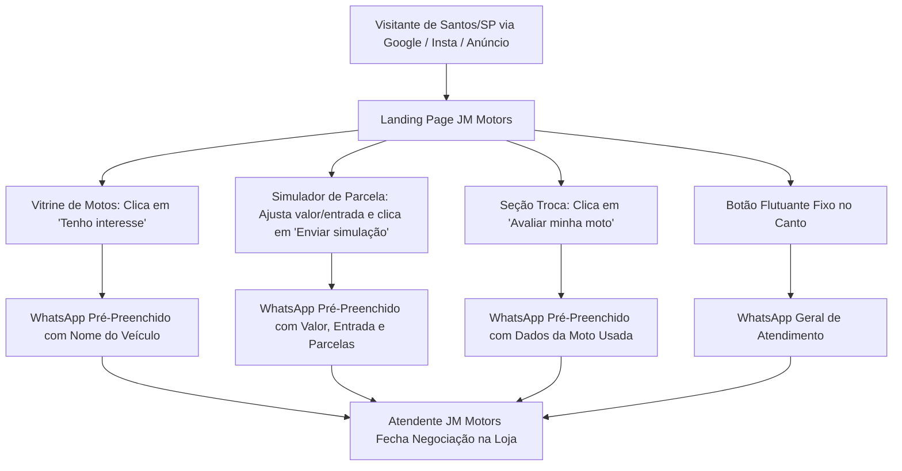

# 05 - Estratégia de Conversão e Funil WhatsApp

A landing page da JM Motors não é apenas institucional; ela é um **motor de geração de leads (Direct Response)** voltado para fechar vendas no WhatsApp.

---

## 1. Funil de Tráfego e Conversão



---

## 2. Modelos de Mensagens Pré-Configuradas

Em `src/lib/jm.ts` e nos componentes, as mensagens utilizam a função `whatsappLink(message)`:

### A. Botão de Interesse no Catálogo:
```text
"Olá, JM Motors! Tenho interesse na [NOME_DA_MOTO]. Ainda está disponível?"
```

### B. Simulador de Financiamento / Cartão:
```text
"Olá, JM Motors! [Meu nome é NOME.] Simulei uma moto de R$ [VALOR] com entrada de R$ [ENTRADA] em [X]x (≈ R$ [PARCELA] por mês). Podem me passar as condições?"
```

### C. Avaliação de Troca ou Venda:
```text
"Olá, JM Motors! Quero avaliar minha moto para venda ou troca. Modelo/ano: "
```

### D. Consignação:
```text
"Olá, JM Motors! Quero deixar minha moto em consignação."
```

---

## 3. Gatilhos Mentais Aplicados na Copy

- **Autoridade Local**: "No coração de Santos", "Na Av. Senador Feijó, 455".
- **Garantia de Preço**: "Melhor avaliação da Baixada Santista".
- **Facilidade Financeira**: "Cartão em até 24x", "Aprovação facilitada na hora".
- **Urgência Suave**: "O estoque gira rápido — chame no WhatsApp para ver as unidades disponíveis hoje".
- **Economia Concreta**: "Rode mais gastando centavos por recarga".

---

## Notas Relacionadas
- [[00 - Indice Geral MOC]]
- [[04 - Negocio JM Motors e Segmentos]]
- [[06 - Diagnostico Tecnico e Roadmap de Melhorias]]
